# Google Cloud Platform Deployment - Executive Summary

## Overview

This architecture specification provides the most cost-effective approach to deploy the Modern SaaS Template on Google Cloud Platform using Cloud Run and Cloud SQL. The solution is optimized for startups and small teams requiring professional-grade infrastructure at minimal cost.

## High-Level Architecture

```mermaid
%%{init: {'theme':'base', 'themeVariables': {
  'primaryColor': '#E8F4FD',
  'primaryTextColor': '#2D3748',
  'primaryBorderColor': '#4A90E2',
  'lineColor': '#4A90E2',
  'secondaryColor': '#F0F9FF',
  'tertiaryColor': '#E2E8F0',
  'background': '#FFFFFF',
  'mainBkg': '#F7FAFC',
  'secondBkg': '#EDF2F7'
}}}%%

flowchart TD
    subgraph Internet["🌐 Internet"]
        Users[👥 Users<br/>app.elitizon.com]
    end
    
    subgraph GCP["☁️ Google Cloud Platform"]
        subgraph Frontend["🎨 Frontend Layer"]
            Web[🌐 Cloud Run Web<br/>Next.js App<br/>$5-15/month]
        end
        
        subgraph Backend["⚡ Backend Layer"]
            API[🔌 Cloud Run API<br/>Hono.js Server<br/>$3-10/month]
        end
        
        subgraph Data["💾 Data Layer"]
            DB[(🗄️ Cloud SQL<br/>PostgreSQL<br/>$7-25/month)]
        end
        
        subgraph DevOps["🔧 DevOps"]
            Registry[📦 Artifact Registry<br/>$0.05/month]
            Build[🏗️ GitHub Actions<br/>Free Tier]
        end
    end
    
    subgraph External["🔌 External Services"]
        Auth[🔐 Clerk Auth]
        Payment[💳 Stripe]
        Email[📧 Resend]
        Monitor[📊 Monitoring]
    end
    
    Users --> Web
    Web --> API
    API --> DB
    API --> External
    Build --> Registry
    Registry --> Web
    Registry --> API
    
    style Users fill:#E8F4FD,stroke:#4A90E2,stroke-width:2px,color:#2D3748
    style Web fill:#E6FFFA,stroke:#38B2AC,stroke-width:2px,color:#2D3748
    style API fill:#FFF5F5,stroke:#E53E3E,stroke-width:2px,color:#2D3748
    style DB fill:#F0FFF4,stroke:#38A169,stroke-width:2px,color:#2D3748
    style Registry fill:#FFFAF0,stroke:#DD6B20,stroke-width:2px,color:#2D3748
    style External fill:#FAF5FF,stroke:#805AD5,stroke-width:2px,color:#2D3748
```

## Key Benefits

### Cost Efficiency

- **Minimal Setup**: $15-25/month for development/testing
- **Production Ready**: $40-80/month for low-medium traffic
- **Scale-to-Zero**: Pay only for actual usage
- **No Infrastructure Management**: Serverless approach reduces operational costs

### Technical Advantages

- **Automatic Scaling**: Handle traffic spikes without pre-provisioning
- **High Availability**: Built-in redundancy and failover
- **Security**: Managed security updates and patches
- **Integration**: Native GCP service integration with external SaaS providers

## Architecture Components

### Core Services

1. **Cloud Run Frontend** (Next.js): 1 vCPU, 1GB RAM, scale 0-10 instances
2. **Cloud Run API** (Hono.js): 1 vCPU, 512MB RAM, scale 0-5 instances
3. **Cloud SQL PostgreSQL**: Shared-core instance (f1-micro for dev, g1-small for prod)
4. **Artifact Registry**: Container image storage
5. **Cloud Build**: CI/CD automation

### External Integrations

- **Clerk**: Authentication and user management
- **Stripe**: Payment processing
- **Resend**: Transactional emails
- **Sentry**: Error monitoring
- **PostHog**: Analytics

## Cost Breakdown

### Development Environment Cost Visualization

### Deployment Timeline

### Development Environment

| Service              | Configuration                | Monthly Cost   |
| -------------------- | ---------------------------- | -------------- |
| Cloud Run (Frontend) | 1 vCPU, 1GB, scale-to-zero   | $5             |
| Cloud Run (API)      | 1 vCPU, 512MB, scale-to-zero | $3             |
| Cloud SQL            | db-f1-micro, 10GB SSD        | $7             |
| Container Registry   | 1GB storage                  | $0.05          |
| Cloud Build          | 10 builds/month              | $1             |
| **Total**            |                              | **~$16/month** |

### Production Environment

| Service              | Configuration               | Monthly Cost      |
| -------------------- | --------------------------- | ----------------- |
| Cloud Run (Frontend) | 1 vCPU, 1GB, min=0, max=10  | $15-35            |
| Cloud Run (API)      | 1 vCPU, 512MB, min=0, max=5 | $8-20             |
| Cloud SQL            | db-g1-small, 20GB SSD       | $15-25            |
| Container Registry   | 2GB storage                 | $0.20             |
| Cloud Build          | 20 builds/month             | $3                |
| Load Balancer        | Optional for custom domain  | $18               |
| **Total**            |                             | **$41-101/month** |

## Implementation Approaches

### Option 1: gcloud Automation (Recommended)

- **Scripted Provisioning**: Reproducible deployments via `deploy/deploy-production.sh`
- **Environment Management**: Configurable project- and region-level settings
- **Team Collaboration**: Shared scripts and documented workflow
- **Best for**: Small teams ready for production workloads

### Option 2: Managed Platform (Vercel)

- **Fast Onboarding**: Minimal infrastructure setup
- **Hosted Platform**: Automatic scaling and CDN support
- **Manual Integrations**: Requires manual API/database configuration
- **Best for**: Early prototypes or marketing-facing sites

## Deployment Strategy

### CI/CD Pipeline

1. **GitHub Actions** (Recommended): Free for public repos, cost-effective for private
2. **Automated Testing**: Unit, integration, and E2E tests
3. **Multi-Environment**: Separate dev, staging, and production deployments
4. **Rollback Capability**: Automatic rollback on deployment failures

### Container Optimization

- **Multi-stage Builds**: Minimize image sizes
- **Alpine Linux Base**: Smaller, more secure base images
- **Layer Caching**: Reduce build times and registry costs
- **Security Scanning**: Automated vulnerability detection

## Cost Optimization Features

### Automatic Cost Controls

- **Scale-to-Zero**: No charges during idle periods
- **Resource Right-Sizing**: Optimal CPU and memory allocation
- **Budget Alerts**: Proactive cost monitoring
- **Automated Cleanup**: Remove unused resources and old container images

### Performance Optimizations

- **High Concurrency**: 100 requests per instance (API), 80 per instance (Web)
- **Connection Pooling**: Efficient database connection management
- **Regional Deployment**: Single region to minimize network costs
- **CDN Integration**: Optional CloudFlare for static asset caching

## Security and Compliance

### Built-in Security

- **HTTPS Termination**: Automatic SSL certificate management
- **IAM Integration**: Fine-grained access controls
- **VPC Connectivity**: Secure service-to-service communication
- **Secret Management**: Environment variable security

### Monitoring and Observability

- **Cloud Monitoring**: Built-in metrics and alerting
- **Cloud Logging**: Centralized log aggregation
- **Error Tracking**: Sentry integration for application errors
- **Performance Monitoring**: Request tracing and optimization insights

## Getting Started

### Prerequisites

1. Google Cloud Project with billing enabled
2. GitHub repository for code hosting
3. Domain name (optional, for custom branding)
4. External service accounts (Clerk, Stripe, etc.)

### Quick Start (30 minutes)

1. **Clone Template**: Use the Modern SaaS Template repository
2. **Configure Environment**: Set up environment variables
3. **Deploy Infrastructure**: Run the production deployment script
4. **Set Up CI/CD**: Configure GitHub Actions workflow
5. **Test Deployment**: Verify services are running correctly

### Production Readiness (2-4 hours)

1. **Security Review**: Configure IAM policies and secrets
2. **Monitoring Setup**: Configure alerts and dashboards
3. **Custom Domain**: Set up Load Balancer and SSL
4. **Database Migration**: Import existing data if applicable
5. **Performance Testing**: Load testing and optimization

## Scaling Considerations

### Traffic Growth

- **0-1K users**: Current setup handles easily
- **1K-10K users**: Increase max instances and database tier
- **10K+ users**: Consider regional deployment and caching

### Cost Scaling

- **Linear Growth**: Costs scale proportionally with usage
- **Optimization Points**: Database tier upgrades, reserved capacity
- **Budget Planning**: Predictable cost model based on traffic

## Risk Mitigation

### High Availability

- **Multi-zone Deployment**: Automatic failover within region
- **Database Backups**: 7-day retention with point-in-time recovery option
- **Service Redundancy**: Multiple Cloud Run instances for load distribution

### Disaster Recovery

- **Infrastructure as Code**: Quick environment recreation
- **Database Backups**: Automated backup and restore procedures
- **Container Registry**: Immutable image storage with versioning

## Next Steps

1. **Review Specifications**: Read detailed architecture documents
2. **Set Up Environment**: Follow infrastructure provisioning guide
3. **Deploy Application**: Use CI/CD automation specifications
4. **Optimize Costs**: Implement cost optimization strategies
5. **Monitor Performance**: Set up alerting and monitoring

## Documentation Structure

The complete specification includes:

- `01_gcp_cost_optimal_architecture.md`: Detailed architecture overview
- `02_infrastructure_provisioning.md`: Step-by-step setup instructions
- `03_deployment_automation.md`: CI/CD pipeline configuration
- `04_cost_optimization_strategies.md`: Comprehensive cost management

## Support and Maintenance

### Ongoing Costs

- **Maintenance Time**: ~2-4 hours/month for updates and monitoring
- **Service Updates**: Automatic for managed services
- **Security Patches**: Handled by Google Cloud and container updates

### Recommended Reviews

- **Weekly**: Cost and performance monitoring
- **Monthly**: Security updates and optimization opportunities
- **Quarterly**: Architecture review and scaling decisions

This architecture provides a solid foundation for a modern SaaS application with professional-grade infrastructure at startup-friendly costs, designed to scale efficiently with your business growth.
