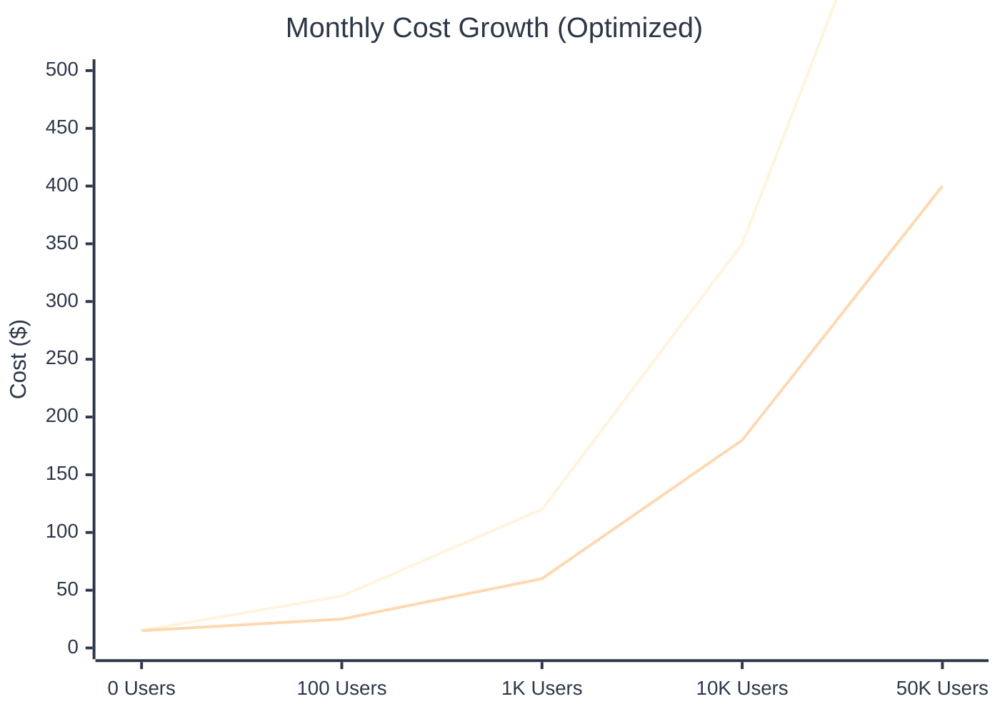

# Cost Optimization Strategies for Google Cloud Platform

## Overview

This document provides comprehensive strategies to minimize Google Cloud Platform costs while maintaining performance, reliability, and scalability for the Modern SaaS Template deployment.

## Cost Analysis Framework

### Cost Optimization Hierarchy

```mermaid
%%{init: {'theme':'base', 'themeVariables': {
  'primaryColor': '#E8F4FD',
  'primaryTextColor': '#2D3748',
  'primaryBorderColor': '#4A90E2',
  'lineColor': '#4A90E2',
  'secondaryColor': '#F0F9FF',
  'tertiaryColor': '#E2E8F0',
  'background': '#FFFFFF',
  'mainBkg': '#F7FAFC',
  'secondBkg': '#EDF2F7'
}}}%%

pyramid
    title Cost Optimization Priority Pyramid
    section Foundation
        desc Right-sizing Resources
        value 40%
    section Infrastructure
        desc Auto-scaling & Scale-to-Zero
        value 30%
    section Operations
        desc Monitoring & Alerts
        value 20%
    section Advanced
        desc Reserved Capacity & Commitments
        value 10%
```

### Monthly Cost Evolution



### Monthly Cost Breakdown

#### Minimum Viable Setup ($15-25/month)

- **Cloud Run (API)**: $3-8
- **Cloud Run (Web)**: $5-12
- **Cloud SQL (f1-micro)**: $7-10
- **Container Registry**: $0.05-0.20
- **Networking**: $0-2
- **Build/CI**: $1-3

#### Production Setup ($40-80/month)

- **Cloud Run (API)**: $8-20
- **Cloud Run (Web)**: $15-35
- **Cloud SQL (g1-small)**: $15-25
- **Container Registry**: $0.20-0.50
- **Load Balancer**: $18 (optional)
- **Build/CI**: $3-8
- **Monitoring**: $2-5

## Cloud Run Cost Optimization

### 1. Right-sizing Resources

#### Memory Optimization

```yaml
# API Service (Hono.js - lightweight)
resources:
  limits:
    memory: "512Mi"  # Start small, monitor usage
    cpu: "1"

# Web Service (Next.js - more memory needed)
resources:
  limits:
    memory: "1Gi"    # Sufficient for SSR
    cpu: "1"
```

#### CPU Allocation Strategy

```yaml
# Use minimum CPU allocation
cpu: "1"  # 1 vCPU minimum
# Alternative for very light workloads
cpu: "0.5"  # Fractional CPU (if supported)
```

### 2. Concurrency Optimization

#### High Concurrency Settings

```yaml
# Maximize requests per instance
containerConcurrency: 100  # API service
containerConcurrency: 80   # Web service (lower due to SSR)
```

#### Benefits

- **Fewer instances**: Higher concurrency = fewer cold starts
- **Better resource utilization**: More requests per instance
- **Lower costs**: Pay for fewer instance-hours

### 3. Auto-scaling Configuration

#### Aggressive Scale-to-Zero

```yaml
metadata:
  annotations:
    autoscaling.knative.dev/minScale: "0" # Scale to zero
    autoscaling.knative.dev/maxScale: "5" # Conservative max
    run.googleapis.com/execution-environment: "gen2" # More efficient
```

#### Traffic-based Scaling

```yaml
# For production with consistent traffic
metadata:
  annotations:
    autoscaling.knative.dev/minScale: "1" # Always-warm instance
    autoscaling.knative.dev/maxScale: "10"
    autoscaling.knative.dev/targetConcurrencyUtilization: "70"
```

### 4. Request Timeout Optimization

```yaml
# Reduce timeout for cost efficiency
spec:
  timeoutSeconds: 60 # Instead of default 300
```

**Benefits:**

- Prevents long-running requests consuming resources
- Faster instance recycling
- Lower per-request costs

## Cloud SQL Cost Optimization

### 1. Instance Sizing Strategy

#### Development Environment

```sql
-- Use shared-core instances
Tier: db-f1-micro
Memory: 0.6 GB
CPU: Shared
Cost: ~$7-10/month
```

#### Production Environment

```sql
-- Start with small dedicated
Tier: db-g1-small
Memory: 1.7 GB
CPU: Shared
Cost: ~$15-25/month

-- Scale up only when needed
Tier: db-n1-standard-1
Memory: 3.75 GB
CPU: 1 vCPU
Cost: ~$45-60/month
```

### 2. Storage Optimization

#### SSD Storage Configuration

```bash
# Start with minimal storage
gcloud sql instances create saas-db \
  --storage-type=SSD \
  --storage-size=10GB \
  --storage-auto-increase \
  --storage-auto-increase-limit=100GB
```

#### Storage Best Practices

- **Start small**: 10GB minimum, auto-increase enabled
- **Monitor growth**: Set reasonable limits (100GB max)
- **Archive old data**: Regular cleanup procedures
- **Use compression**: Enable PostgreSQL compression

### 3. Backup Cost Optimization

#### Efficient Backup Strategy

```bash
# Optimize backup retention
gcloud sql instances patch saas-db \
  --backup-start-time=03:00 \
  --retained-backups-count=7 \
  --no-backup-point-in-time-recovery  # Saves ~$10/month
```

#### Backup Cost Breakdown

- **Standard backups**: ~$0.023/GB/month
- **Point-in-time recovery**: Additional ~$0.023/GB/month
- **Strategy**: Disable PITR for development, enable for production only

### 4. High Availability Considerations

#### Development: No HA

```bash
--availability-type=ZONAL  # Single zone, cheaper
```

#### Production: Conditional HA

```bash
--availability-type=REGIONAL  # Only if required for SLA
# Additional cost: ~100% increase
```

### 5. Connection Optimization

#### Connection Pooling

```typescript
// Use connection pooling to reduce instance load
import { Pool } from "pg";

const pool = new Pool({
  connectionString: process.env.DATABASE_URL,
  max: 20, // Maximum connections
  idleTimeoutMillis: 30000,
  connectionTimeoutMillis: 2000,
});
```

#### Cloud SQL Proxy Benefits

- **Secure connections**: No need for IP whitelisting
- **Connection pooling**: Built-in efficiency
- **Cost optimization**: Reduces connection overhead

## Container Registry Cost Optimization

### 1. Image Size Optimization

#### Multi-stage Dockerfile Strategy

```dockerfile
# Use minimal base images
FROM node:18-alpine AS base  # Smaller than ubuntu
FROM oven/bun:slim AS runner # Minimal bun runtime

# Remove unnecessary files
RUN rm -rf /tmp/* /var/cache/apk/* /var/tmp/*
```

#### Image Cleanup Strategy

```bash
# Automated cleanup of old images
gcloud container images list-tags gcr.io/PROJECT/IMAGE \
  --filter="timestamp.datetime < -P30D" \
  --format="get(digest)" | \
  xargs gcloud container images delete --quiet
```

### 2. Registry Storage Optimization

#### Storage Class Configuration

```bash
# Use standard storage (cheapest)
gsutil lifecycle set lifecycle.json gs://artifacts.PROJECT.appspot.com
```

#### Lifecycle Policy (`lifecycle.json`)

```json
{
  "rule": [
    {
      "action": { "type": "Delete" },
      "condition": {
        "age": 30,
        "matchesPrefix": ["latest"]
      }
    }
  ]
}
```

## Networking Cost Optimization

### 1. Regional Deployment

#### Single Region Strategy

```bash
# Deploy all services in same region
REGION="us-central1"  # Lowest cost region

# Avoid cross-region traffic
gcloud run deploy --region=$REGION
gcloud sql instances create --region=$REGION
```

#### Regional Cost Comparison

- **us-central1**: Lowest cost baseline
- **us-east1**: ~Same as us-central1
- **europe-west1**: ~10-15% higher
- **asia-southeast1**: ~10-15% higher

### 2. Load Balancer Optimization

#### When to Skip Load Balancer

- **Development**: Use Cloud Run URLs directly
- **Small projects**: Cloud Run provides HTTPS termination
- **Cost savings**: ~$18/month
- **Custom domains**: Cloud Run supports direct domain mapping

#### Cloud Run Custom Domain (No Load Balancer Needed)

```bash
# Map custom domain directly to Cloud Run service
gcloud run domain-mappings create \
  --service=saas-web-prod \
  --domain=app.elitizon.com \
  --region=us-central1

# Get the required DNS records
gcloud run domain-mappings describe app.elitizon.com \
  --region=us-central1
```

**Benefits:**

- **Free SSL certificates**: Automatic Google-managed SSL
- **Zero additional cost**: No load balancer fees
- **Simple setup**: Direct domain to service mapping
- **Automatic renewal**: SSL certificates auto-renew

**Limitations:**

- **Single region**: Domain points to one region only
- **No advanced routing**: Simple domain-to-service mapping
- **No WAF features**: Basic security only

#### When Load Balancer is Worth It

- **Multi-region deployment**: Geographic distribution
- **Advanced routing**: Path-based or host-based routing
- **WAF requirements**: Web Application Firewall features
- **Multiple backends**: Complex traffic distribution

### 3. CDN and Caching

#### CloudFlare Integration (Free Tier)

```javascript
// Configure CloudFlare for static assets
module.exports = {
  images: {
    domains: ["cdn.cloudflare.com"],
  },
  async headers() {
    return [
      {
        source: "/static/(.*)",
        headers: [
          {
            key: "Cache-Control",
            value: "public, max-age=31536000, immutable",
          },
        ],
      },
    ];
  },
};
```

## CI/CD Cost Optimization

### 1. GitHub Actions Optimization

#### Free Tier Maximization

```yaml
# Use free Ubuntu runners
runs-on: ubuntu-latest

# Conditional builds
if: github.ref == 'refs/heads/main'

# Parallel jobs to reduce time
strategy:
  matrix:
    service: [api, web]
```

#### Build Time Optimization

```yaml
# Cache dependencies
- uses: actions/cache@v3
  with:
    path: ~/.bun/install/cache
    key: ${{ runner.os }}-bun-${{ hashFiles('**/bun.lock') }}

# Use efficient package manager
- uses: oven-sh/setup-bun@v1
```

### 2. Cloud Build Cost Management

#### Build Configuration

```yaml
# Use cost-effective machine type
options:
  machineType: 'E2_HIGHCPU_8'  # Faster builds = lower cost

# Concurrent steps where possible
- name: 'Build API and Web'
  waitFor: ['-']  # Run in parallel
```

#### Build Frequency Control

```bash
# Skip builds for documentation changes
gcloud builds triggers create github \
  --ignored-files="docs/**,*.md,specs/**"
```

## Monitoring and Alerting Cost Optimization

### 1. Native GCP Monitoring

#### Free Tier Maximization

```bash
# Use free allotment efficiently
# 50 metrics per month free
# Focus on critical metrics only
```

#### Cost-Effective Alerting

```bash
# Email notifications (free)
gcloud alpha monitoring policies create \
  --policy-from-file=alert-policy.yaml
```

### 2. Alternative Monitoring Solutions

#### Open Source Options

- **Prometheus + Grafana**: Self-hosted on Cloud Run
- **Uptime monitoring**: Simple HTTP checks
- **Log aggregation**: Use Cloud Logging free tier

## Automated Cost Controls

### 1. Budget Alerts

#### Proactive Budget Management

```bash
# Set up budget alerts
gcloud billing budgets create \
  --billing-account=$BILLING_ACCOUNT_ID \
  --display-name="SaaS App Budget" \
  --budget-amount=50 \
  --threshold-rule=percent=50,basis=CURRENT_SPEND \
  --threshold-rule=percent=90,basis=CURRENT_SPEND \
  --threshold-rule=percent=100,basis=CURRENT_SPEND \
  --all-updates-rule-monitoring-notification-channels=$NOTIFICATION_CHANNEL
```

### 2. Automated Shutdown

#### Development Environment Shutdown

```bash
#!/bin/bash
# shutdown-dev.sh - Run as cron job

# Scale down development services after hours
gcloud run services update saas-api-dev \
  --region=us-central1 \
  --min-instances=0

gcloud run services update saas-web-dev \
  --region=us-central1 \
  --min-instances=0
```

### 3. Resource Quotas

#### Project-level Quotas

```bash
# Set quotas to prevent runaway costs
gcloud compute project-info add-metadata \
  --metadata=quotas="compute.instances.per.region=5"
```

## Environment-Specific Strategies

### Development Environment

#### Ultra-minimal Setup

```yaml
# Shared resources where possible
database: shared_development_instance
instances: scale-to-zero
monitoring: basic_only
backups: minimal_retention
```

#### Cost Target: $10-15/month

### Staging Environment

#### Production-like but Smaller

```yaml
# Smaller resource allocations
api_memory: 512Mi
web_memory: 1Gi
database: db-f1-micro
max_instances: 3
```

#### Cost Target: $20-35/month

### Production Environment

#### Performance vs Cost Balance

```yaml
# Optimized for reliability and cost
api_memory: 512Mi-1Gi
web_memory: 1-2Gi
database: db-g1-small
min_instances: 1 # For warm starts
max_instances: 10
```

#### Cost Target: $40-80/month

## Cost Monitoring Dashboard

### 1. Key Metrics to Track

```javascript
// Cost monitoring metrics
const costMetrics = {
  cloudRun: "run.googleapis.com/request_count",
  cloudSQL: "cloudsql.googleapis.com/database/cpu/utilization",
  storage: "storage.googleapis.com/api/request_count",
  network: "compute.googleapis.com/instance/network/sent_bytes_count",
};
```

### 2. Weekly Cost Review

#### Automated Reporting

```bash
# Weekly cost report script
gcloud billing accounts list
gcloud billing budgets list --billing-account=$BILLING_ACCOUNT_ID
```

## Emergency Cost Controls

### 1. Immediate Shutdown Procedures

```bash
#!/bin/bash
# emergency-shutdown.sh

echo "Emergency shutdown initiated..."

# Scale down all Cloud Run services
for service in $(gcloud run services list --format="value(metadata.name)"); do
  gcloud run services update $service --min-instances=0 --max-instances=0
done

# Stop Cloud SQL instance
gcloud sql instances patch saas-db --no-activation-policy
```

### 2. Cost Spike Investigation

#### Quick Diagnosis Commands

```bash
# Check current month spending
gcloud billing accounts get-billing-info $PROJECT_ID

# Identify top cost drivers
gcloud billing budgets list --billing-account=$BILLING_ACCOUNT_ID

# Review recent deployments
gcloud logging read "resource.type=cloud_run_revision" --limit=50
```

## Long-term Cost Optimization

### 1. Reserved Capacity (Future)

#### Committed Use Discounts

- **Cloud SQL**: 1-year commitments for 20% discount
- **Compute Engine**: Not applicable to Cloud Run
- **Consider when**: Consistent baseline load

### 2. Architecture Evolution

#### Microservices Considerations

```yaml
# Current: 2 services (API + Web)
# Future optimization: Selective service scaling
api_auth: minimal_resources
api_payments: scale_with_usage
api_analytics: batch_processing
```

### 3. Data Archival Strategy

#### Cold Storage Migration

```sql
-- Archive old data to cheaper storage
SELECT * FROM orders WHERE created_at < NOW() - INTERVAL '1 year';
-- Move to Cloud Storage for $0.012/GB/month
```

## Cost Optimization Checklist

### Weekly Tasks

- [ ] Review billing dashboard
- [ ] Check resource utilization
- [ ] Clean up unused container images
- [ ] Monitor service scaling patterns

### Monthly Tasks

- [ ] Analyze cost trends
- [ ] Review and adjust quotas
- [ ] Optimize underutilized resources
- [ ] Update cost forecasts

### Quarterly Tasks

- [ ] Evaluate service tier migrations
- [ ] Review architectural decisions
- [ ] Consider reserved capacity options
- [ ] Benchmark against alternatives

## ROI Analysis

### Cost vs Value Metrics

- **Cost per user**: Target < $0.50/month
- **Cost per transaction**: Target < $0.01
- **Infrastructure cost ratio**: Target < 20% of revenue
- **Development velocity**: Maintain while optimizing

This comprehensive cost optimization strategy should help maintain your GCP expenses in the $15-80/month range while providing a robust, scalable SaaS platform.
